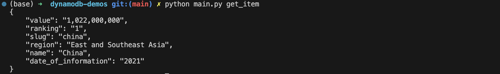
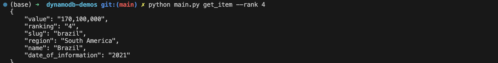
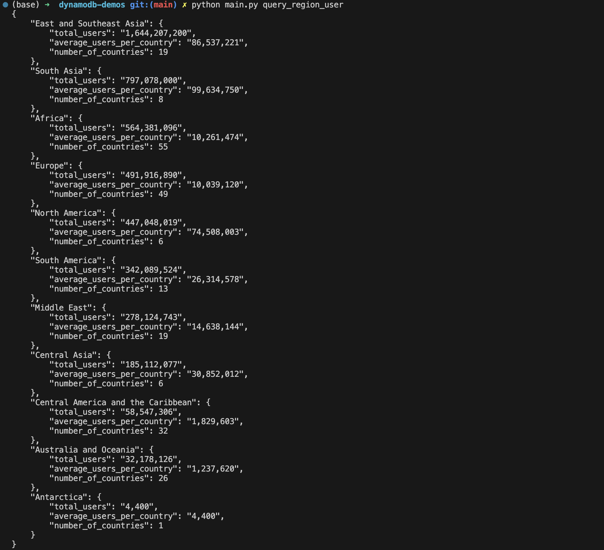

# DynamoDB Demos
Complex SQL Query for a NoSQL Database - DynamoDB

## Files
* `dynamodb.py` - Python script to perform CRUD and query on DynamoDB.
* `main.py` - Python script to convert functions in `dynamodb.py` into CLI.
* `country_internet_user.csv` - CSV file containing data to be added to the DynamoDB table.

## Usage
* `python main.py create_table` - Create a DynamoDB table.

    ```python
    def create_table(dynamodb=None):
        if not dynamodb:
            dynamodb = boto3.resource("dynamodb")

        table = dynamodb.create_table(
            TableName="ciu",  # Table name
            KeySchema=[{"AttributeName": "ranking", "KeyType": "HASH"}],  # partition key
            AttributeDefinitions=[{"AttributeName": "ranking", "AttributeType": "S"}],
            ProvisionedThroughput={"ReadCapacityUnits": 5, "WriteCapacityUnits": 5},
        )

        return table
    ```

* `python main.py delete_table` - Delete a DynamoDB table.

    ```python
    def delete_table(dynamodb=None):
        if not dynamodb:
            dynamodb = boto3.resource("dynamodb")

        table = dynamodb.Table("ciu")
        table.delete()  # Delete the table

        return table
    ```

* `python main.py load_csv` - Load data from a CSV file to the DynamoDB table.
    
    ```python
    def load_csv(dynamodb=None):
    if not dynamodb:
        dynamodb = boto3.resource("dynamodb")

    table = dynamodb.Table("ciu")  # Table to load data into

    with codecs.open("country_internet_user.csv", "r", encoding="utf-8-sig") as csvfile:
        reader = csv.DictReader(csvfile, delimiter=";")  # read csv file
        for row in reader:
            item = {
                "name": row["name"],
                "slug": row["slug"],
                "value": row["value"],
                "date_of_information": row["date_of_information"],
                "ranking": row["ranking"],
                "region": row["region"],
            }
            table.put_item(Item=item)  # put item in table

    return table
    ```

* `python main.py put_item` - Add data to the DynamoDB table.

    ```python
    def put_item(dynamodb=None):
    if not dynamodb:
        dynamodb = boto3.resource("dynamodb")

    table = dynamodb.Table("ciu")
    response = table.put_item(Item={"ranking": "0", "name": "dummy"}) # put item in table

    return response
    ```

* `python main.py get_item` - Get data from the DynamoDB table.

    ```python
    def get_item(dynamodb=None, rank=1):
    if not dynamodb:
        dynamodb = boto3.resource("dynamodb")

    table = dynamodb.Table("ciu")
    response = table.get_item(Key={"ranking": str(rank)}) # get item from table with key
    print(json.dumps(response["Item"], indent=4))
    return response
    ```

* `python main.py update_item` - Update data in the DynamoDB table.

    ```python
    def update_item(dynamodb=None):
    if not dynamodb:
        dynamodb = boto3.resource("dynamodb")

    table = dynamodb.Table("ciu")

    response = table.update_item(
        Key={"ranking": "0"},
        UpdateExpression="SET #name = :new_name",
        ExpressionAttributeNames={"#name": "name"},
        ExpressionAttributeValues={
            ":new_name": "United Nations"
        },  # update item in table with new name
        ReturnValues="UPDATED_NEW",
    )

    return response
    ```
* `python main.py delete_item` - Delete data from the DynamoDB table.
    
    ```python
    def delete_item(dynamodb=None):
    if not dynamodb:
        dynamodb = boto3.resource("dynamodb")

    table = dynamodb.Table("ciu")
    response = table.delete_item(
        Key={"ranking": "0"}
    )  # Delete item from table with key

    return response
    ```
* `python main.py query_region_user` - Query data from the DynamoDB table, return total user number, total country and average user number for each region, sorted by total user number.

    ```python
    def query_region_user(dynamodb=None):
    if not dynamodb:
        dynamodb = boto3.resource("dynamodb")

    table = dynamodb.Table("ciu")

    response = table.scan(
        ProjectionExpression="#r, #v",
        ExpressionAttributeNames={"#r": "region", "#v": "value"},
    )

    # Sort items based on the 'region' key
    sorted_response = sorted(response["Items"], key=lambda x: x["region"])

    # Group items by the 'region' key
    grouped_response = groupby(sorted_response, key=lambda x: x["region"])

    # Dictionary to store total and average values for each region
    region_data = {}

    # Iterate through the grouped items and calculate the sum and average user value
    for region, items in grouped_response:
        region_sum = 0
        count = 0

        # Calculate the sum of values and count of items in the current group
        for item in items:
            region_sum += int(item["value"].replace(",", ""))
            count += 1

        # Calculate average user value
        average_value = int(region_sum / count) if count != 0 else 0

        # Format the total and average values with commas as thousands separators
        formatted_sum = format(region_sum, ",d")
        formatted_average = format(average_value, ",d")

        # Store total and average values in the dictionary
        region_data[region] = {
            "total_users": formatted_sum,
            "average_users_per_country": formatted_average,
            "number_of_countries": count,
        }

    # Sort the dictionary by value in descending order
    sorted_region_data = dict(
        sorted(
            region_data.items(),
            key=lambda x: int(x[1]["total_users"].replace(",", "")),
            reverse=True,
        )
    )
    # Print the dictionary containing total and average values for each region
    print(json.dumps(sorted_region_data, indent=4))
    ```

## Example

* Sample data from the CSV file


* Get country with ranking 1 (default ranking is 1)



* Get country with ranking 4



* Query data from the DynamoDB table, return total and average values for each region with sorted order of total users


